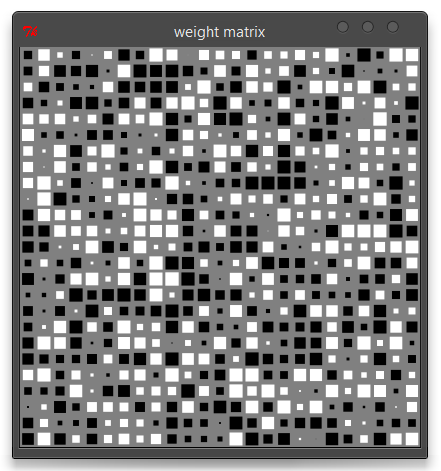

# hinton

Create hinton diagrams in Julia.

Hinton diagrams are used to visualize weight matrices in neural networks. Here is a pure Julia/Tk implementation.

### Usage

```julia
using hinton

hintondiag(matrix)
```



**License** MIT
